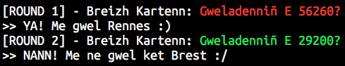

# Breizh Kartenn

## Introduction

**Catégorie** : programmation

**Points** : 300

**Flager** : PLT

La description de l'épreuve contient une ip avec un port. Les instructions apparaissent une fois connecté en telnet.

```zsh
telnet 148.60.87.243 9400
```
Le serveur envoie une question avec un code postal d'une ville de Bretagne. 

- Si la question apparait en vert, il faut répondre `YA! Me gwel Rennes :)`. 
- Si la question apparait en rouge, il faut répondre `NANN! Me ne gwel ket Brest :/` 

Il faut bien sur répondre avec le nom de la ville correspondant au code postal.

 - Temps maximum pour répondre à une question : 2 secondes
 - Nombre de réponses à donner : 600
 - Indice donné au bout de quelques heures : [http://www.linternaute.com/ville/bretagne/region-53/villes](http://www.linternaute.com/ville/bretagne/region-53/villes)



## Analyse

A première vue, l'épreuve ne présente pas d'inconnues ni de compléxité particulière. Un script Python permettra de répondre automatiquement aux questions.

Pourtant, il existe plusieurs difficultés : 

 - Doit-on répondre le nom exact de la ville ? Avec quelle casse ? Avec les accents ? Qu'en est-il des villes avec tirets et accents ? 
 - Que faire quand un code postal est partagé par plusieurs villes ? 
[http://www.linternaute.com/ville/recherche?q=29600](http://www.linternaute.com/ville/recherche?q=29600)

#### Environnement de développement :

 - Langage : Python 3.6
 - IDE : PyCharm CE

## Implémentation

###[breizhkartenn.py](./breizhkartenn.py)

### Client *telnet*

`telnetlib` permet de gérer très simplement un socket TCP.
Seules les méthodes `read_until` et `write` sont necessaires pour lire et écrire dans le socket.

### *Parser*

La chaine brute reçue pour une question est la suivante : 

```
[ROUND 1] - Breizh Kartenn: \x1b[91mGweladenni\xc3\xb1 E 56260?\x1b[0m\n>>
```

Les séquences de caractères qui commencent par `\x1b` servent [à afficher de la couleur](http://jafrog.com/2013/11/23/colors-in-terminal.html) ou des caractères spéciaux dans le terminal.


`re.search` est utilisé pour passer chaque question. Deux entrées doivent être extraites :

 - La couleur ANSI
 	- 91 = 
 	- 92 = 
 -  Le code postal

Pour cela, il faut utiliser cette expression régulière : `"\[(\d+).*E (\d{5})"`
   

### Dictionnaire des villes

Un dictionnaire contennant le nom des villes avec pour clé leur code postal est construit à partir d'un fichier `csv`

#### bzh1.csv et bzh2.csv

Ces deux fichiers `bzh1.csv` et `bzh2.csv` ont été construits à partir de fichiers `csv` sources téléchargés sur [https://www.data.gouv.fr/](https://www.data.gouv.fr/). Ils ont ensuite été filtrés avec un tableur.

Aucune de ces sources n'a permis de valider l'épreuve :

 - `bzh1.csv` : Les noms de villes ne correspondent pas car il sont en majuscule, sans les accents et sans les tirets
 - `bzh2.csv` : Les noms des villes sont correctes mais il y a des doublons de codes postaux. Le serveur semble n'accépter qu'un nom de ville par code postal.

#### bzh3.csv

Finalement, la page qui a permis de créer la source des villes et codes postaux est dévoilée. On peut donc créer un fichier `csv` en parsant la page.

```zsh
curl -A "Firefox" http://www.linternaute.com/ville/bretagne/region-53/villes |
grep -A 2 "Bretagne : les principales villes de la région" |
grep -Eo '[^>]+ \(\d+\)' |
sed -E 's/^(.+) \(([0-9]{5}).+$/\1;\2;/' > bzh3.csv
```
Avec le `User-Agent` par défaut le site renvoie une 403 donc il faut utiliser `curl -A`

Il reste cependant des doublons de codes postaux et plusieurs villes génèrent des erreurs.

Il a été necessaire de corriger manuellement certaines villes, puis, après quelques relances, le *flag* est apparu. Heureusement, il n'a fallu que 42 réponses pour valider l'épreuve et pas 600 comme indiqué dans les instructions.

## Bilan

### Les +

 - Le côté *brezhoneg* avec les questions et les réponses en breton. Il ne manquait plus que de répondre avec les noms de villes en Breton également.
 - 300 points, c'est bien payé !

### Les -

 - On regrette que le serveur n'ait pas été configuré pour être plus permissif sur le nom des villes et les doublons de code postaux. J'ai passé plus de la moitié de l'épreuve à essayer de corriger mes listes de codes postaux. Ce n'est que lorsque l'indice a été donné que j'ai été débloqué.


