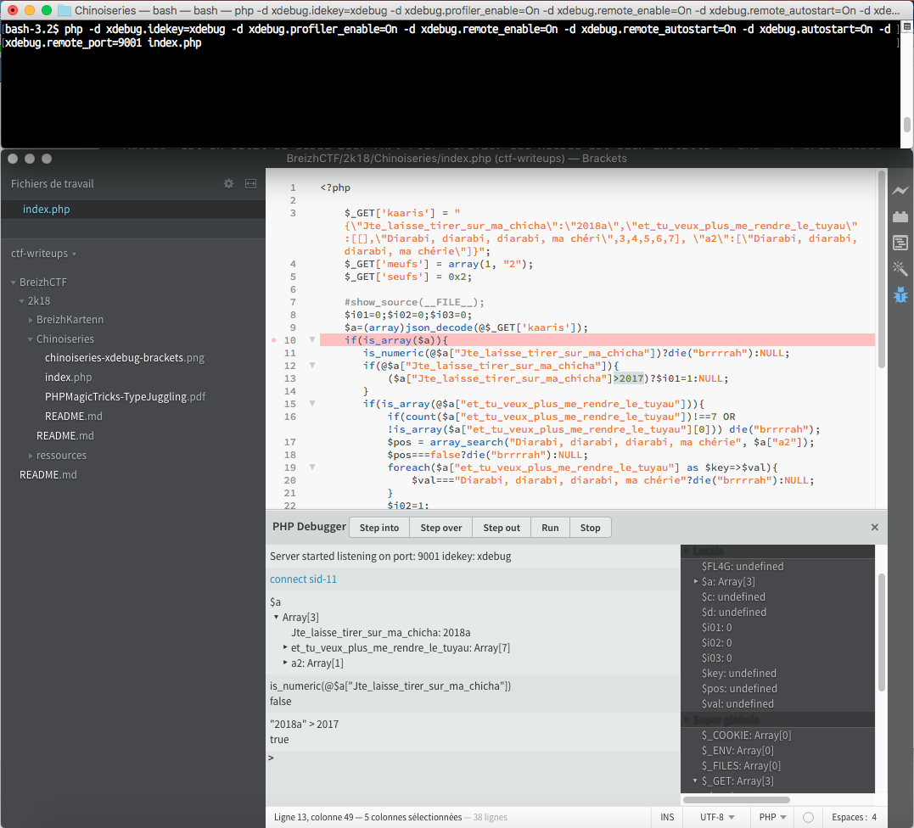

# Breizh Kartenn

## Introduction

**Catégorie** : web

**Points** : 150

**Flager** : PLT

La description de l'épreuve contient une ip avec un port. En chargeant la page on récupère un code php.

```zsh
curl 148.60.87.243 44815
```

```php
<?php

    show_source(__FILE__);
    $i01=0;$i02=0;$i03=0;
    $a=(array)json_decode(@$_GET['kaaris']);
    if(is_array($a)){
       is_numeric(@$a["Jte_laisse_tirer_sur_ma_chicha"])?die("brrrrah"):NULL;
       if(@$a["Jte_laisse_tirer_sur_ma_chicha"]){
           ($a["Jte_laisse_tirer_sur_ma_chicha"]>2017)?$i01=1:NULL;
       }
       if(is_array(@$a["et_tu_veux_plus_me_rendre_le_tuyau"])){
           if(count($a["et_tu_veux_plus_me_rendre_le_tuyau"])!==7 OR !is_array($a["et_tu_veux_plus_me_rendre_le_tuyau"][0])) die("brrrrah");
           $pos = array_search("Diarabi, diarabi, diarabi, ma chérie", $a["a2"]);
           $pos===false?die("brrrrah"):NULL;
           foreach($a["et_tu_veux_plus_me_rendre_le_tuyau"] as $key=>$val){
               $val==="Diarabi, diarabi, diarabi, ma chérie"?die("brrrrah"):NULL;
           }
           $i02=1;
       }
    }
    $c=@$_GET['meufs'];
    $d=@$_GET['seufs'];
    if(@$c[1]){
       if(!strcmp($c[1],$d) && $c[1]!==$d){
           eregi("3|1|c",$d.$c[0])?die("brrrrah"):NULL;
           strpos(($c[0].$d), "Diarabi, diarabi, faut qu'on fasse du wari")?$i03=1:NULL;
       }
    }
    if($i01 && $i02 && $i03){
       include "flag.php";
       echo $FL4G;
    }

?>
```

## Analyse

La première ligne `show_source(__FILE__);` permet de comprendre que le code php affiché correspond au script PHP qui s'execute sur le serveur.

A la fin du fichier on peut voir qu'il faut passer les variables `$i01`, `$i02` et `$i03` à *true* pour que le fichier `flag.php` s'execute et affiche le *flag*.

```
if($i01 && $i02 && $i03){
       include "flag.php";
       echo $FL4G;
}
```

En analysant le code on remarque des lignes qui semblent en contradiction :

```
is_numeric(@$a["Jte_laisse_tirer_sur_ma_chicha"])?die("brrrrah"):NULL;
...
$a["Jte_laisse_tirer_sur_ma_chicha"]>2017)?$i01=1:NULL;
```

Ici la valeur de `$a["Jte_laisse_tirer_sur_ma_chicha"]` ne doit pas être numérique mais doit pourtant être supérieure à `2017`. [Chinoiserie](http://www.larousse.fr/dictionnaires/francais/chinoiserie/15393)
 vous avez dit ?

On imagine donc qu'il faut abuser la façon dont PHP interprète les différents types. On appelle cette pratique "manipulation de types" ou plus communément *type juggling*. 

Voici un document qui détail bien les différents techniques de *type juggling* :

 - [PHPMagicTricks-TypeJuggling.pdf](PHPMagicTricks-TypeJuggling.pdf)

### Environnement

 - Langage : PHP 7.1
 - IDE : Brackets (MacOS) + extension [PHP Debugger](https://github.com/spocke/php-debugger)
 - Debuger : Xdebug
 - Serveur : Nginx

### Xdebug

Dans ce genre d'épreuve il est important de passer un peu de temps à configurer un debuger avant de se lancer. Cela évite d'avancer en aveugle et vous donne une maitrise totale de l'execution. 

`xdebug` est un *debugger* PHP. Pour vérifier que xdebug est bien installé : `php -m | grep xdebug`

Pour lancer le script en mode debug depuis la ligne de commande :
```zsh
php -d xdebug.idekey=xdebug -d xdebug.profiler_enable=On \
-d xdebug.remote_enable=On -d xdebug.remote_autostart=On \
-d xdebug.autostart=On -d xdebug.remote_port=9000
```

Il est également possible de configurer un envionemment web local avec Apache ou Nginx. Il faut alors activier et paramètrer `xdebug` dans les fichiers de configuration PHP.

Comme client Xdebug sur MacOS je conseil l'éditeur de texte Brackets avec l'extention [PHP Debugger](https://github.com/spocke/php-debugger).




## Solution

### $i01 et $i02

Les paramètres pour manipuler `$i01` et `$i02` viennent de `$_GET['kaaris']` qui doit contenir un JSON.

La difficulté pour avoir la variable `$i01` à `true` est qu'il faut valider deux conditions entagonistes :

``` php
is_numeric(@$a["Jte_laisse_tirer_sur_ma_chicha"])?die("brrrrah"):NULL;
```

```
$a["Jte_laisse_tirer_sur_ma_chicha"]>2017)?$i01=1:NULL;
```

Une valeur possible est `"2018m"`.

`is_numeric`considère que `"2018m"` n'est pas une valuer numérique.
>http://php.net/manual/fr/function.is-numeric.php
> 
>Détermine si la variable donnée est de type numérique. Les chaînes numériques sont composées optionnellement de signes, de n'importe quel nombre de chiffres, optionnellement d'une partie décimale ainsi qu'une partie exponentielle. +0123.45e6 est une valeur numérique valide. Les notations hexadécimale (i.e. 0xf4c3b00c) et binaire (i.e. 0b10100111001) ne sont pas autorisées.

Quand une chaine de caractère est comparé à un type numérique, PHP utilise la fonction `intval` pour évaluer la chaine. Or `intval("2018m")` retourne `2018`

(voir [PHPMagicTricks-TypeJuggling.pdf](PHPMagicTricks-TypeJuggling.pdf) page 8 et 9)

Pas de difficulté particulière ensuite.

### $i03

La difficulté pour avoir $i03 à `true` est de passer cette condition
`if(!strcmp($c[1],$d) && $c[1]!==$d)`

Ma première approche fut d'utiliser `$c[1]=1` et `$d='1'` se qui marchaint bien. Sauf que `1` passé en paramètre dans l'url ne donne pas un entier mais un string. Donc on se retrouve finalement avec `$c[1]='1'` et `$d='1'`.

Pour passer cette condition il faut que `$d` soit un tableau : `http://148.60.87.243:44815/?seufs[]=&...`

(voir [PHPMagicTricks-TypeJuggling.pdf](PHPMagicTricks-TypeJuggling.pdf) page 35). 

### Payload finale

Il faut que les paramètres soient bien url-encodés.

```
http://148.60.87.243:44815/?seufs[]=&meufs[]=_Diarabi%2c%20diarabi%2c%20faut%20qu%27on%20fasse%20du%20wari&meufs[]=a&kaaris={%22Jte_laisse_tirer_sur_ma_chicha%22%3a%222018a%22%2c%22et_tu_veux_plus_me_rendre_le_tuyau%22%3a[[]%2c2%2c3%2c4%2c5%2c6%2c7]}
```

## Bilan

 - Peux d'inconnes dans cette épreuve car le code source est visible.
 - Necessite d'avoir une environnement PHP avec un serveur local ou de bien connaitre les finesses du *type juggling* PHP.


