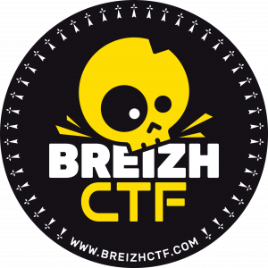

# Breizh CTF 2018

Les 20 et 21 avril 2018 de 20h à 8h

Campus de Beaulieu, Université de Rennes 1

[https://www.breizhctf.com/](https://www.breizhctf.com/)

[https://vimeo.com/265870042](https://vimeo.com/265870042)

## Write-ups

**Equipe** : ThinkPothers

**Points** : 1401 pts

**Classement** : 35/56

 - [BreizhKartenn](./BreizhKartenn) (programmation, 300 pts)
 - [Chinoiseries](./Chinoiseries) (web, 150 pts)